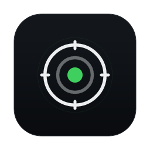
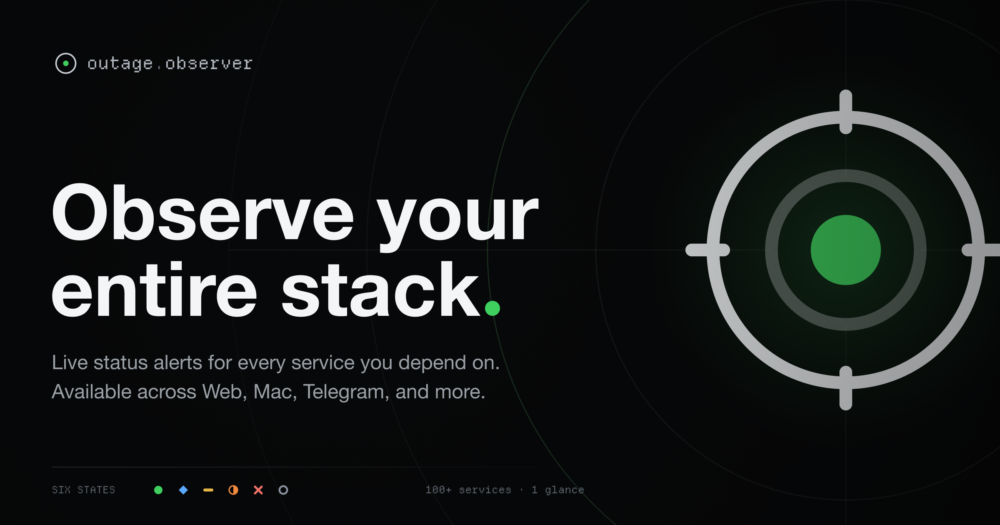
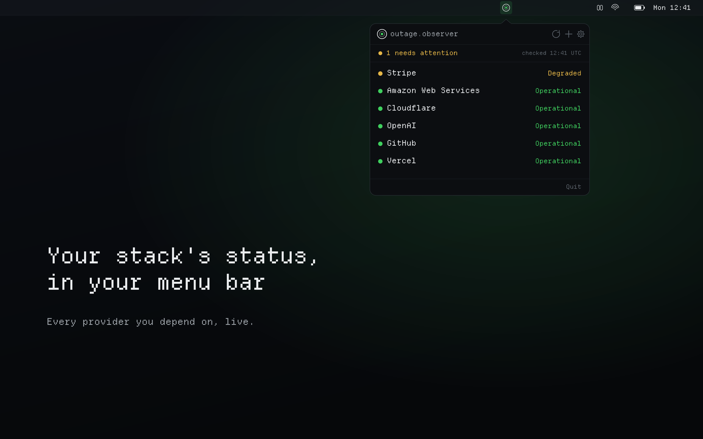

<div align="center">



# Outage Observer

**Live status for every service you depend on. One calm pane of glass, and a ping the moment something breaks.**

[](https://outage.observer)
[](https://t.me/outageobserverbot)
[](LICENSE.md)



</div>

## What it is

Outage Observer watches the official status pages of 100+ infrastructure and AI
providers (AWS, Cloudflare, OpenAI, Stripe, GitHub, and the rest) and tells you
the instant one you rely on changes state. You pick what to watch; it stays
quiet about everything else.

No account, no tracking, free to use. It polls each provider once and serves
everyone, so the whole thing runs on the Cloudflare free tier.

## Watch it your way

| | |
|---|---|
| 🛰 **Live board** | A no-login status board at **[outage.observer](https://outage.observer)**. Pin your stack; problems float to the top. |
| 💬 **Telegram** | **[@outageobserverbot](https://t.me/outageobserverbot)**. Search, pick your services, get pinged on changes. |
| 🖥 **Mac app** | A native menu-bar app + notifications (below). |
| 🔔 **Browser push** | Enable alerts straight from the board. |
| 🧩 **Slack / Discord** | Paste a webhook URL to post changes into a channel. |
| 📡 **RSS / Atom** | A feed per provider, or one for your whole stack. |

Every provider also has its own page, like **[Is Stripe down?](https://outage.observer/status/stripe)**, with current status and recent incidents.

## The Mac app

<div align="center">

</div>

A native SwiftUI menu-bar app. A quiet reticle in your menu bar glows amber or
red when something you watch has trouble, a notification fires the moment it
changes state, and it stays silent the rest of the time. Light or dark, follows
your Mac. Source lives in [`mac/`](mac/); see [`mac/README.md`](mac/README.md)
to build it.

## How it works

A single Cloudflare Worker does the watching. Every minute it checks each
provider's official status source, normalizes it, and compares against the last
known state. On a real change (and only a real change) it fans the update out
to whoever is watching that provider, across every channel above. Failed checks
keep the last known status rather than inventing a scare, so it never cries wolf.

The board is a cached snapshot served from the edge; per-user subscriptions and
status history live in D1. It's built to never emit a false alert.

## Under the hood

- **Backend:** one Cloudflare Worker (TypeScript) running the cron poller,
  Telegram webhook, push ingest, and the public `/api/status` snapshot. KV holds
  the board; D1 holds subscriptions, the alert outbox, and history.
- **Web:** a static board (`public/`) on Workers Static Assets, plus
  server-rendered per-provider pages, sitemap, and feeds.
- **Mac:** SwiftUI, sandboxed, no account. Reads the public `/api/status`.

## Develop

```bash
npm install
npx wrangler login
npx wrangler dev          # local board + API at http://localhost:8787
```

Deploys to Cloudflare on push to `main` (Workers Builds). The curated provider
list lives in `src/catalog.ts`.

## License

Source-available under the **PolyForm Noncommercial License 1.0.0**: free to
use, modify, and share for **noncommercial** purposes; all commercial rights are
reserved by Ekpani. See [`LICENSE.md`](LICENSE.md). "Outage Observer", "Ekpani",
and the aperture mark are trademarks and are not licensed. Bundled third-party
components keep their own licenses; see [`THIRD-PARTY-NOTICES.md`](THIRD-PARTY-NOTICES.md).

<div align="center"><sub><a href="https://ekpani.com">an ekpani tool</a></sub></div>
